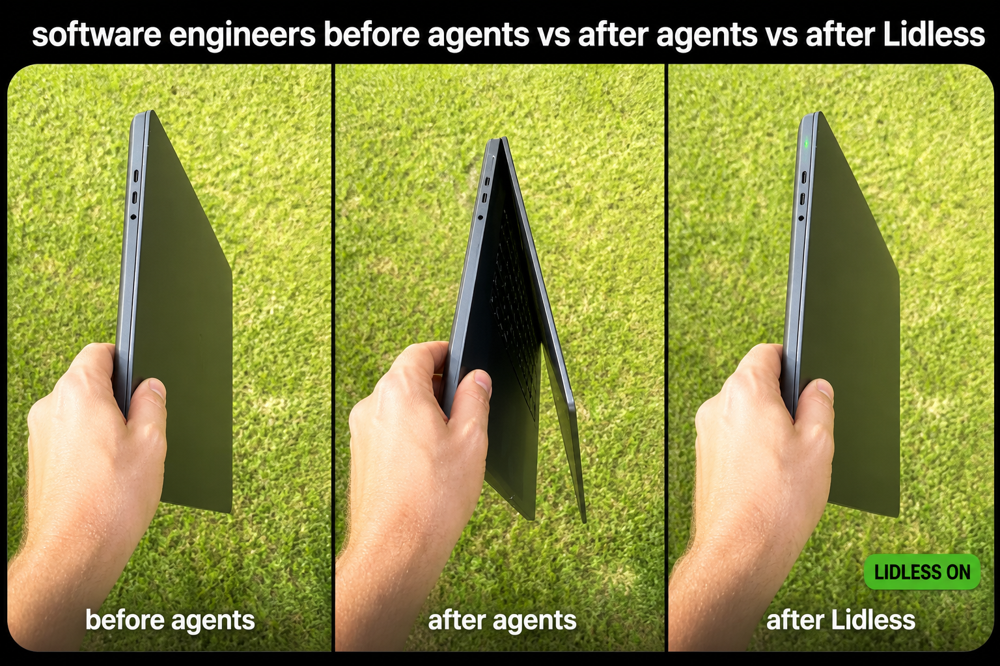
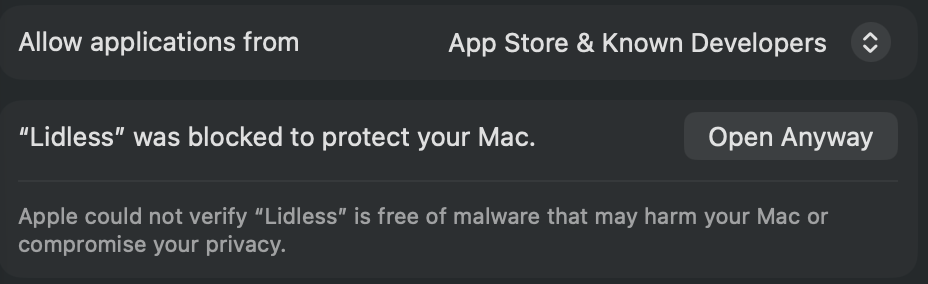

# Lidless

Keep a MacBook reachable over remote desktop **with the lid closed** — without an external monitor.

[](https://github.com/Udovychenko-Dmytro/lidless/releases/latest)
[](https://github.com/Udovychenko-Dmytro/lidless/actions/workflows/ci.yml)
[](LICENSE)
[](#requirements)

A small native app with a live status panel, plus the same logic as a shell script if you prefer the terminal. By default there is no daemon, login item or helper process except `caffeinate`; unattended shutdown support is an explicit optional install.

<p align="center">
  
</p>

Lidless started with the “software engineers before vs after agents” meme. Once coding agents could keep working unattended, developers began leaving their MacBooks slightly open just to prevent lid sleep. The joke exposed a real problem: the work no longer needed the screen, but macOS still needed the lid open. Lidless is the fix — the agent keeps running, and the lid closes properly again.

---

## The problem

You close your MacBook's lid and connect to it from another machine over Chrome Remote Desktop / VNC / Screen Sharing. Either it sleeps and drops the session, or the lock screen flickers on and off every couple of seconds.

That flicker is a loop: the closed lid puts the display to sleep and locks the session, your remote-desktop host immediately asserts "display must stay on" and wakes it, the lid logic locks it again, repeat.

Three things that look like fixes but are not:

| Attempt | Why it fails |
| --- | --- |
| Apple's clamshell mode | Requires an external display **and** external keyboard/mouse. With only the built-in screen it never engages. |
| `caffeinate -s` | Prevents *system idle* sleep, and only on AC power. Closing the lid is a separate code path it does not block. |
| `defaults write com.apple.screensaver askForPassword 0` | **Ignored since macOS Ventura.** The write succeeds and changes nothing — the system stopped reading that key. Verify with `sysadminctl -screenLock status`: the real value will not have moved. |

The setting that actually makes macOS ignore the lid is `pmset disablesleep`, and that needs root.

## The app

<p align="center">
  
</p>

## Download and install

Lidless is currently ad-hoc signed rather than signed with an Apple Developer ID,
so macOS cannot verify its developer automatically. Download it only from this
repository and verify the checksum before approving it in Gatekeeper.

1. Download
   [Lidless-0.1.0-macos-universal.zip](https://github.com/Udovychenko-Dmytro/lidless/releases/latest/download/Lidless-0.1.0-macos-universal.zip)
   and its
   [SHA-256 file](https://github.com/Udovychenko-Dmytro/lidless/releases/latest/download/Lidless-0.1.0-macos-universal.zip.sha256).
2. In Terminal, open the download directory and verify it:
   ```bash
   cd ~/Downloads
   shasum -a 256 -c Lidless-0.1.0-macos-universal.zip.sha256
   ```
   Continue only when it prints `Lidless-0.1.0-macos-universal.zip: OK`.
3. Unzip it and move `Lidless.app` to `/Applications`.
4. Try to open Lidless once. macOS will block the first launch.
5. Open **System Settings → Privacy & Security**, scroll to **Security**, find
   **“Lidless” was blocked to protect your Mac**, and click **Open Anyway**.

   <p align="center">
     
   </p>

6. Confirm **Open** in the final macOS dialog. This approval is normally needed
   only once for that build.

If **Open Anyway** is not visible, try to open Lidless once more and return to
**Privacy & Security**.

As an alternative for a ZIP whose checksum you have verified from the official
release, remove quarantine in Terminal and then open the app:

```bash
xattr -dr com.apple.quarantine /Applications/Lidless.app
open /Applications/Lidless.app
```

> [!CAUTION]
> Lidless sets the persistent system-wide `pmset disablesleep` value. Rebooting
> or deleting the app does not reset it. Press **Disable** before putting the Mac
> in a bag. To recover manually, run `sudo pmset -a disablesleep 0`.

Every value is read from the system every five seconds while the window is open, and every minute while the app runs with its window closed. The panel therefore shows what is actually true right now — not what the app last tried to do.

The window is a band of readings, then the settings, then the shutdown limits. The band answers "what is true" at a glance: five tiles on one grid — the overall verdict, then the battery, the lid, Low Power Mode and the screen lock. Each reads the same way down: what it is about, the answer, and the raw value behind it — `open · disablesleep 0`, `300 seconds`, the battery estimate — so what the window says and what a terminal says can be compared without arithmetic. The Low Power Mode tile always names the current source (`AC` or `battery`) on its bottom line, including while the mode itself is unreadable. The verdict tile is wider and tinted; it is otherwise the same tile, because a band whose blocks each set their text at a different height reads as five unrelated things. Colour is the state, not the category: green means active and managed by Lidless, grey means off and that being off is normal, purple means active but authorised separately (only the screen lock), amber means a decision is needed, red means the Mac is about to be powered off, or `pmset disablesleep` is missing while `caffeinate` holds — the one combination where a closed lid still sleeps the Mac — or the built-in screen is dark with nothing managing it.

Under the band runs a thin strip of sensors — one chip per tile, each sitting under the tile it belongs to and exactly as wide, so the two rows read as one grid. Left to right: what the battery is doing in watts (**Charge** going in, **Drain** coming out) followed by what the connected adapter is rated at — `Charge 0.0 W · 35 W PSU` — then system power, then CPU and GPU temperature sharing one cell — `CPU 54° GPU 45°`, in the same degrees the battery chip beside it spells out — then the battery's temperature, then fan speed. The two battery numbers belong together: 10 W coming out of the battery means nothing until you know the brick feeding the machine is a 35 W one and is therefore losing. On a Mac with no battery at all — a mini, a Studio — that chip reads **No Data**, because an empty chip there looks like a broken sensor rather than a desktop. It answers what holding the Mac awake actually costs. All but the first come from the SMC — the same source iStat Menus reads. The charge figure is current times voltage from the battery itself, because the SMC reports how much power the rail is carrying without saying which way it is going, and which way is the whole point. Every reading is allowed to be missing: a sensor this Mac does not expose shows nothing at all rather than a zero. A part the Mac does not have is different from a sensor that failed, so the fan chip on a fanless Mac reads **No Data** rather than sitting blank — the same answer the charge chip gives a desktop. Two things worth knowing about the figures. Power is a rail total, not what the wall socket sees, so it reads lower than a plug-in meter. And with **Low Power Mode while active** on, everything runs genuinely lower — the same load measured 6.5 W against 21 W with it off — so a strip that reads a third of what another monitor shows is accurate, not broken.

The **Battery** tile goes green while the battery is filling or full, the same green the other tiles use for a thing that is being handled — it is the one tile whose subject can be in a good state on its own. Held at a charge limit by optimised charging is neither filling nor flat, and stays grey.

What the tile says about the source and the charge comes from the battery itself rather than from `pmset`, which lags a plug event by tens of seconds and has been seen calling a 1.5 A charge `not charging`. Current going in is the one thing that cannot be wrong about the direction, so it decides the word and the colour. The charge figure in the strip below is a different matter: it is as fast as the battery gauge that produces it, and that gauge updates every twenty to forty seconds. It will lag the temperatures and watts beside it, which come from the SMC and move every tick.

It has one more thing to say. A Mac under load can draw more than its adapter supplies and quietly take the difference out of the battery — plugged in, and still going down. When that happens the tile turns amber and reads `AC · draining 820 mA` instead of the usual time estimate, because the usual estimate on AC is "not charging", which is exactly what makes the state look normal. For a laptop left plugged in for days as a remote-desktop host, it is the difference between fine and flat by morning.

The settings are split by what they ask of you rather than by subject. **Options** is the plain yes/no list: every line is a box you tick and nothing else. **Screen** holds the two that also want a mode or a duration — darkening the built-in panel and relaxing the screen lock — each with its picker on the same line and its live state as the line underneath. **Turn off automatically** is separate again, because it is the only setting here that ends with the Mac powered off. Beside it is a permanent, nearly square **Permission** card: green with a check when the one-time setup is complete, or amber with an **Install…** button when it is missing.

Under the Screen settings sits a single note panel. Only ever one note shows, and it is ordered by how much trouble you are in: a screen nobody is managing outranks a lid setting that went missing, which outranks a password prompt, which outranks advice. It is also where **Restore panel** appears when it is needed. Permission is deliberately outside this priority chain in its own always-visible card, so another warning cannot hide the installer. A column of warnings trains people to read none of them.

The menu bar popover is a smaller panel of its own: the current state as read-only rows — the sensor readings among them, when there are any — plus Enable, Disable and Quit. Every option lives in the window. That split is deliberate — the window's sections are built for 820 points of width, stacking them into a popover column makes it unusably tall, and on macOS 26.6 a large view in the menu bar scene crashes the app during launch.

The verdict tile summarises the two core halves: **ON** (both applied), **OFF** (neither), or **PARTIAL** — which normally means a password prompt was cancelled halfway; the note panel turns red and says so. If the core is off but a Low Power Mode or screen-lock restore point remains, it reads **RESTORE** and Disable stays available. An unreadable lid probe reads **UNKNOWN** rather than a confident OFF.

While a session is running, that tile's bottom line switches from the explanation to how long the session has been up and which `caffeinate` process is holding it, and the shutdown section counts down to the time limit instead of only naming it.

### Options

| Option | Default | What it does |
| --- | --- | --- |
| Keep awake on battery too | on | Uses `caffeinate -si` instead of `-s`. Without it macOS honours the assertion only on AC power, so on battery the process runs but does nothing. |
| Low Power Mode while active | off | A Mac held awake for hours runs warm. This caps the machine cooler and slower for as long as Lidless is on, then puts your previous setting back. On Macs with fans (MacBook Pro, iMac, Mac mini, Mac Studio) it also keeps them quiet; on fanless MacBook Airs it reduces heat and thermal throttling instead. The one-time helper installation also makes these `pmset` changes silent. On the tested macOS 26.6 build the setting is currently detected as **Unknown** and the change is safely skipped; see [Limitations](#limitations). |
| Also relax the screen lock | off | Stretches the lock grace period to your chosen delay — 5 minutes, 15 minutes, an hour, or never — and restores your original value on Disable. macOS requires the account password when Enable changes this setting and again when Disable restores it; the one-time Lidless permission cannot bypass either prompt. It is unavailable while an automatic-shutdown limit is configured because macOS cannot restore it unattended. |
| Stop other caffeinate on disable | off | Off on purpose. Builds, downloads, media players and other apps run `caffeinate` for their own reasons; killing theirs breaks them. Turn it on only if you keep finding orphans. |
| Disable when quitting | **on** | Quitting the app does everything Disable does, so you cannot leave the lid setting behind by closing up shop. Closing the window is not quitting and changes nothing. See [below](#closing-the-window-is-not-quitting-and-quitting-is-not-always-disabling) — over remote desktop this ends the session it was holding open. |
| Darken the built-in screen | off | Takes the built-in panel down while Lidless is on and the lid is shut, and puts it back when you open the lid. Lives in the **Screen** section, with a two-way picker on the same line: **Virtual display** (default) moves the session onto one and switches the panel off, **Keep panel on** only lowers the brightness and changes nothing else. The row's own second line is the panel's live state, because it is the one thing in this window you may have to act on without being able to see it. Off by default, and read [Panel blackout](#panel-blackout) before turning it on — it is the only option here that changes what you can see. |

Preferences persist between launches, and **the script reads the same settings** — see [Settings are shared](#settings-are-shared). Panel blackout is the one exception in the other direction: the setting is shared, but only the app can act on it (see [Panel blackout](#panel-blackout)).

### Shutting the Mac down automatically

The thing most likely to go wrong with a tool like this is forgetting it. Two automatic power-off limits are available, both disabled by default:

- **After N hours** — the Mac shuts down once the Lidless session has run long enough.
- **Below N% battery** — the Mac shuts down before an unplugged battery drains flat.

This is a real system shutdown, not sleep and not merely disabling Lidless. Running applications are terminated, so unsaved work can be lost. When a limit fires, Lidless warns you and waits 60 seconds. Use **Cancel shutdown** in the app or `./lidless.sh cancel-shutdown` during that grace period to keep the Mac running.

Who enforces them depends on what you have installed:

| | Enforced by | Works after you quit the app? |
| --- | --- | --- |
| App running | the app itself, every five seconds with the window open and every minute otherwise | — |
| App quit | the optional [LaunchAgent](#optional-enforce-automatic-shutdown-after-quitting-the-app) | **yes**, once installed |
| Neither | nothing | no |

The second row is the one that matters when you may quit the app and walk away. Installing the LaunchAgent keeps the limits active in that case.

Lidless shows a permanent permission card beside the automatic-shutdown controls. When the complete permission is missing, its **Install…** button opens the bundled installer in Terminal. After entering the administrator password once, **Enable**, **Disable**, Low Power Mode changes and automatic shutdown use narrow `sudo -n` rules without asking again. If the setup is absent, manual Enable/Disable can still use the ordinary macOS authorization dialog; Enable is blocked only when an unattended automatic-shutdown limit is selected. Screen-lock relaxation remains separate because `sysadminctl` requires the account password interactively. The equivalent command from a checkout is:

```bash
./tools/install-auto-shutdown.sh
```

Before asking for `sudo`, the installer verifies that the helper it is about to make root is the one this build shipped: `./build.sh` records the helper's SHA-256 in `Contents/Resources/lidless-manifest.sha256` inside the signed bundle, and the installer compares against it — from a private copy of the file, so the bytes digested are the bytes installed. A mismatch refuses with exit code 3 before a single `sudo` runs. This matters because `/Applications` is group-writable: without the check, any process running as you could overwrite the shipped helper and let your one admin password turn it into a permanently password-free root command. A source checkout has no manifest and skips the check with a warning; a *bundle* whose manifest is missing is refused. Before asking for `sudo`, the installer also prints both destination paths and the exact sudoers rule. It places an argument-free helper at `/Library/PrivilegedHelperTools/io.github.lidless.poweroff`, inside a root-owned system directory. Its narrow rule permits the fixed helper plus only the exact lid and Low Power Mode assignments used by Lidless. Lidless verifies every required assignment, including both `disablesleep 1` for Enable and `disablesleep 0` for Disable, so a partial old rule is never reported as ready. The helper first submits `/sbin/shutdown -h now` while closed-lid sleep is still blocked, then makes a best-effort `disablesleep 0` cleanup. This ordering prevents a closed MacBook from sleeping in the gap before the shutdown request. It cannot execute arbitrary commands or accept caller-controlled arguments. Lidless also checks the installed helper version, so upgrading to this build may offer **Install permission…** once more to replace an older helper.

If the helper is missing, denied, or the kernel rejects the shutdown request, the Mac is not shut down. The running app waits five minutes before retrying so a five-second status refresh cannot create a tight failure loop. Manual Disable remains available immediately and only disables Lidless; it never powers off the Mac.

An unreadable lid-state probe does not cancel a limit that is already due when Lidless still has a tracked PID or session timestamp. With no tracked Lidless session, an ambiguous probe is reported but never treated as permission to shut the computer down.

Low Power Mode is restored noninteractively before the shutdown request; if that restore fails, shutdown continues but the restore point is kept and a notification explains the remaining work. An outstanding screen-lock restore cancels automatic shutdown because restoring it requires the account password. Open Lidless and press Disable first.

The app also lives in the menu bar as well as a window, and its background polling is intentionally lightweight.

### Panel blackout

Off by default. Read this before turning it on: it is the only thing here that changes what you can see. The app says the same before it lets you: ticking the option asks for confirmation, states the trade-offs of both modes, and names the way back — so the warning exists before the state it warns about, not only after.

Lidless keeps the Mac awake with the lid shut, and a side effect of that is a panel nobody is looking at staying lit behind a closed lid. Normally clamshell sleep switches it off, but `pmset disablesleep` blocks that path and takes the display's part with it. The display-sleep timeout does not help either while you are working remotely: every mouse movement over remote desktop resets it.

There are **two ways** to take the panel down, and the choice is yours because they fail in opposite directions:

| | What it does | What it costs |
| --- | --- | --- |
| **Virtual display** *(default)* | Creates a virtual display, moves the session onto it, switches the built-in off | The session moves, so the display artefacts listed below become possible |
| **Keep panel on** | Leaves the display exactly where it is and lowers its brightness to the hardware minimum | Nothing about the session changes and none of those artefacts can happen — but the panel is very dim rather than off |

**Start with the default, and switch to Keep panel on if the picture comes back wrong.** That is the entire decision rule; everything below is the detail behind it.

Both apply only while Lidless is on **and** the lid is shut, and both reverse when you open it. Going dark was measured at about eight seconds from the lid closing; coming back is polled once a second while the panel is off, because macOS does not announce a lid opening once the built-in has been switched out of the display configuration.

**Keep panel on** is worth understanding as more than a fallback: the display never leaves the configuration, so the failure this feature is capable of — a Mac whose only screen is gone, recovered with the power button — **cannot occur in that mode at all**. Everything in the recovery section below exists for the other one. The price is honest and worth stating: the hardware minimum is around 0.5 % of full brightness, so the panel is faint rather than dark, and unlike a switched-off display that level survives a reboot.

**What changes while "Virtual display" is on, honestly** — none of this applies to dimming:

- The resolution in points is identical and no applications are closed: the virtual display is built from the panel's *current* mode, whatever that is. **The pixel density drops from 2× to 1×**, so text is noticeably less sharp until the panel returns.
- **On a Mac with a camera housing, the notch does not come along.** A virtual display cannot have one. If the panel is in a mode that reserves the strip beside the camera, the blackout display is the same size in points but has no safe-area inset, so the menu bar and anything laid out against the safe area shift for as long as it lasts. In a mode that already letterboxes below the camera there is nothing to lose and the geometry matches exactly.
- Window positions, full-screen windows and Spaces are not guaranteed. Neither is the menu bar's position, nor the behaviour of applications that cache display information — Metal, games, screen recorders.
- Remote desktop renegotiates the stream: the session survives, but it blinks.
- The lock screen flickers as the displays are reconfigured.
- The virtual display's colour does not match the panel's.

**If something goes wrong,** there are three ways back, in the order they are meant to be reached for. They matter most in "Virtual display"; dimming has the brightness key on your keyboard as a fourth way that needs no software at all, which is most of why it is the safer mode.

1. **Open the lid.** The normal case, and the one that is meant to happen.
2. **The recovery watchdog.** Lidless starts a small companion process alongside every blackout, which watches for Lidless dying *or* silently hanging and puts the screen back on its own. Blackout will not start unless that watchdog is running — verified working against a real crash, where it restored the screen about seven seconds later with nobody asking.
3. **The recovery tool, by hand**, if the watchdog is somehow gone too:
   ```bash
   ./lidless.sh rescue-display
   ```
   It takes no arguments, trusts no display list, and only ever makes displays appear and backlights come up — so it is safe to run twice, safe to run when nothing is wrong, and safe to run without knowing what is wrong. `--explain` prints what it would do and changes nothing.

One thing that is **not** a way back, though it looks like one:

- **Force-quitting Lidless does not undo it.** The display change is scoped to the app's process, and it was assumed for most of this feature's development that macOS therefore reverts it when the app dies. It does not: tested by removing the watchdog first, the screen stayed off indefinitely. Every earlier test that appeared to show self-healing was watching the watchdog do the work. This is why the watchdog is mandatory rather than a nicety.

**"Virtual display" never changes your brightness setting.** Switching the display off is enough on its own to take the backlight down — measured over 16 minutes on mains and 15 on battery with the backlight register pinned at zero the whole time — so that mode has no reason to touch the slider, and does not. The panel comes back at the level you left it on, because that level was never lost. An earlier version dimmed first, on the strength of a measurement that turned out to be wrong.

**"Keep panel on" is the opposite**, and this is the one thing to know before choosing it: lowering the brightness *is* the whole mechanism, and macOS remembers brightness across restarts. Lidless puts your level back when the lid opens, and a crash is covered by the same watchdog and recovery tool as the other mode. But if all of that is bypassed — a power cut, say — the panel comes back faint and stays faint until something raises it. It is deliberately left at a dim-but-legible level rather than at zero, so the screen still reads as a working Mac and your keyboard's brightness key is enough to fix it.

*The level it puts back is the one remembered from while the lid was still open, not one read at the moment it dims.* By then macOS has usually started its own fade for the closing lid, and a reading taken there can be half what you were actually using — measured at 0.256 against a working 0.56, and 0.360 against 0.84. Sampling earlier is what stops the screen returning dimmer than you left it.

Verified on this Mac: 54 minutes held with the lid shut, 1519 samples two seconds apart, the backlight pinned at its hardware minimum the whole time and the display never once leaving the list. Restoring took about eight seconds from the lid opening.

Two more things worth knowing. This is the one feature the shell script cannot do: the virtual display exists only as long as the process that created it, so a shell command would create it, switch the panel off and exit — undoing both immediately. It belongs to the app, and `lidless.sh`'s part is `rescue-display`. And it needs no administrator password at all, unlike everything else here: it uses per-user display APIs rather than `pmset`.

Everything above was measured on one Mac — an M4 MacBook Air on macOS 26.6. The display APIs involved are private and undocumented, so a macOS update is entirely allowed to take them away. Lidless names the missing piece and disables the option rather than guessing when that happens.

### Settings are shared

The app writes its checkboxes to the `io.github.lidless` defaults domain, and `lidless.sh` reads that same domain. Ticking "Low Power Mode while active" in the app changes what `./lidless.sh on` does.

When the domain has no answer for a key — which is the normal case if you only ever use the script — the script falls back to the constants near the top of `lidless.sh`. It works standalone; you do not have to build the app.

| Defaults key | Script fallback | Affects |
| --- | --- | --- |
| `keepAwakeOnBattery` | `ENABLE_KEEP_AWAKE_ON_BATTERY` | `caffeinate -si` vs `-s` |
| `lowPowerWhileActive` | `ENABLE_LOW_POWER_MODE` | `pmset -a lowpowermode 1` |
| `relaxScreenLock` | `ENABLE_SCREENLOCK_TOGGLE` | whether the screen lock is touched |
| `screenLockDelay` | `LIDLESS_SCREENLOCK_DELAY` | the relaxed delay (`0` means never) |
| `stopAllCaffeinate` | `ENABLE_STOP_ALL_CAFFEINATE` | whether `off` stops other `caffeinate` processes |
| `automaticShutdownAfterHoursV1` | `SHUTDOWN_AFTER_HOURS_DEFAULT` | the automatic shutdown time limit |
| `automaticShutdownBelowBatteryPercentV1` | `SHUTDOWN_BELOW_BATTERY_PERCENT_DEFAULT` | the automatic shutdown battery limit |
| `blackoutBuiltinDisplayV1` | *(none — the script cannot act on it)* | whether [Panel blackout](#panel-blackout) arms when the lid closes |
| `panelModeV1` | *(none — the script cannot act on it)* | which way it darkens the panel: `virtual` (default) or `dim`. Anything else reads as `virtual` |

One setting is **not** shared: `disableOnQuit` belongs to the app alone, because a shell script has nothing to quit. The script ignores it.

`./lidless.sh status` prints which of the two it is using, and what every setting currently resolves to. Set one without the app if you like:

```bash
./lidless.sh set automaticShutdownAfterHoursV1 4
```

Bare `./lidless.sh set` lists every key with its current value and its allowed set. The allowed sets are the app's own Picker choices, and that is the point of going through `set` rather than `defaults write` directly: `defaults` accepts anything, and a hand-written value outside the set — say `screenLockDelay 60` — works in the script but renders in the app as a Picker with nothing selected. `set` refuses it and names the values that exist. A running app picks a change up immediately; no restart needed.

## Requirements

macOS 13 or newer. The current release is built as a universal `arm64` and
`x86_64` bundle. Its primary real-hardware validation was on Apple Silicon — an
M4 MacBook Air running macOS 26.6 — so the minimum deployment target and Intel
slice have not received the same amount of field testing. Building needs the
Xcode command line tools (`xcode-select --install`). Admin rights are required,
because `pmset` needs root — except for [Panel blackout](#panel-blackout), which
needs none.

## Build and run

A built app is committed at `build/Lidless.app`, so a clone runs without a toolchain:

```bash
git clone https://github.com/Udovychenko-Dmytro/lidless.git
cd lidless
open build/Lidless.app
```

That bundle is ad-hoc signed, not notarized, and it is only as trustworthy as
this repository. Building it yourself is still supported and takes a few
seconds, and it is the option that does not require taking the committed binary
on faith:

```bash
./build.sh
open build/Lidless.app
```

`git clone` normally does not apply browser quarantine, so the committed app can
also be opened directly from a checkout. GitHub's **Download ZIP** source archive
and the packaged release asset arrive through the browser and are quarantined;
follow [Download and install](#download-and-install) to verify and approve the
release, or run `./build.sh` to build it yourself.

`build.sh` compiles two universal binaries (Apple Silicon + Intel) — the app, and
the `lidless-display-rescue` recovery tool that ships inside it — then assembles
the bundle and ad-hoc signs it. The build fails instead of publishing a partial
artifact if either architecture or code signing fails. Everything it produces
stays in `build/`; only the finished `build/Lidless.app` is committed, and the
compiler intermediates and logs beside it are gitignored. Rebuilding the same
source with a different Swift/Xcode toolchain can change the Mach-O bytes and
ad-hoc signature, so byte-for-byte identity is guaranteed only for the committed
bundle and its release archive, not for arbitrary local rebuilds. Move
`build/Lidless.app` to `/Applications` if you want to keep it, or point it
elsewhere with `OUT=dist ./build.sh`. When `OUT` already exists, the build
replaces only its own `Lidless.app` and private intermediate directory; unrelated
files in that directory are preserved.

The automatic-shutdown helper, installer, and uninstaller are copied into the app's Resources directory before signing. This is why **Install permission…** continues to work after moving `Lidless.app` away from the source checkout.

### Command line instead

`lidless.sh` does the same thing without the GUI, with one exception noted below. It shares both its state files **and its settings** with the app, so you can enable in one and disable in the other, and a checkbox ticked in the app applies to the script:

```bash
chmod +x lidless.sh
./lidless.sh on
./lidless.sh status
./lidless.sh off
./lidless.sh set                   # list the shared settings; 'set <key> <value>' to change one
./lidless.sh cancel-shutdown
./lidless.sh rescue-display        # put the built-in screen back; --explain to dry-run
```

The exception is [Panel blackout](#panel-blackout). `on` does not switch the panel off and `off` does not switch it back on, because the virtual display that carries the session cannot outlive a shell command. That one belongs to the app; the script's part is `rescue-display`, which runs the app's own recovery binary and is safe to run at any time, including when the app is not running at all.

`status` reports the same four things the window does and used to keep to itself: a **pending automatic shutdown** and how many seconds are left, how long the current **session** has been up and how long the hours limit leaves it, whether the built-in panel is **blacked out** right now (and whether whoever is holding it still has a live heartbeat — the thing you most need over SSH, since that is when the screen is not available to tell you), and whether the one-time **power permission** is installed, outdated or missing. Its headline for a half-restored state reads `OFF — RESTORE PENDING`, which is the window's `RESTORE` pill in the terminal's words.

### Tests

```bash
./tests/run.sh
```

Fixture-driven: the parsers are run against command output captured from real Macs (`tests/fixtures/`), and the probes against fakes in `tests/bin/` that stand in for `pmset`, `ioreg`, `sysadminctl`, `sudo` and friends. Nothing touches the real system — `HOME` is redirected into a temp directory, and `sudo` is never actually invoked — so it is safe to run while Lidless is on. Where `swiftc` is available it also checks the app's parsers against the identical fixtures, because the app and the script must not disagree about the same Mac. There is no CI — run it yourself before trusting a change.

---

## What it actually changes

Five separate mechanisms, with very different lifetimes. "Ignore lid close" is the one to be careful with.

| Parameter | Mechanism | Scope | Survives reboot? | Survives app quit? |
| --- | --- | --- | --- | --- |
| Keep awake | a `caffeinate -si` process | your user | no | only with "Disable when quitting" off |
| Ignore lid close | `pmset -a disablesleep 1` | whole system | **yes** | only with "Disable when quitting" off |
| Low Power Mode | `pmset -a lowpowermode 1` | whole system, per power source | **yes** | only with "Disable when quitting" off |
| Screen lock delay | `sysadminctl -screenLock <seconds>` | your account | yes | only with "Disable when quitting" off |
| Panel blackout — Virtual display | a virtual display plus a per-app display disable | this app's process | no | **no — always undone on quit**, whatever "Disable when quitting" says |
| Panel blackout — Keep panel on | `DisplayServicesSetBrightness` to the hardware minimum | your display | **yes** — brightness persists, which is why the marker and the watchdog still apply | **no — always undone on quit** |
| └ the panel's brightness, Virtual display mode only | not changed in that mode — `DisplayServicesSetBrightness` is used only by recovery, on a panel found dark with no owner | your display | n/a | n/a |

The reboot column is the one that matters most: nothing in that column is undone by restarting, and `disablesleep` in particular is written to a system plist that will happily outlive the app, the repo and your memory of installing it. Quitting now cleans up by default, but a force-quit, a crash or a power cut does not — which is what the warning below and the [watchdog](#optional-enforce-automatic-shutdown-after-quitting-the-app) are for.

Panel blackout is put back on quit unconditionally: "Disable when quitting" is a choice about whether to leave a *session* running, and nobody chooses to be left looking at a dark screen.

It is the odd one out on the reboot column too. The display change itself does not survive a restart. It does **not**, however, undo itself when the app dies — that is the mistaken assumption described under [Panel blackout](#panel-blackout), and it is why the recovery watchdog is mandatory.

Brightness is where the two modes genuinely differ, and the difference is the reason the reboot column above splits them. **Virtual display** never touches brightness: nothing to persist, nothing to put back. **Keep panel on** does — it writes the hardware minimum, and macOS persists brightness across a reboot and a crash alike. That is precisely why that mode needs the marker on disk and the recovery watchdog: they are what bring a panel left at 1% back to a readable level when the app is not around to do it.

Runtime state files written by the app and script:

| Path | Purpose |
| --- | --- |
| `~/.lidless_caffeinate_pid` | PID of the `caffeinate` this tool started |
| `~/.lidless_screenlock_prev` | your original screen-lock delay, so Disable can put it back |
| `~/.lidless_lowpower_prev` | your original Low Power Mode setting as `ac:battery` |
| `~/.lidless_enabled_at` | when Lidless was turned on, in Unix seconds, for the automatic shutdown time limit |
| `~/.lidless_lock` | held only while an Enable/Disable is in progress, so the CLI and the app can't race each other; empty, and left in place between operations |
| `~/.lidless_shutdown_pending` | deadline of the current 60-second shutdown grace period. Written by whichever side armed it — the app or the watchdog — so `lidless.sh cancel-shutdown` can stop either |
| `~/.lidless_shutdown_cancel` | cancellation signal consumed by the watchdog |
| `~/.lidless_display_prev` | marks that a blackout is in progress, so a restarted app or `rescue-display` can find it. Also records the panel's brightness, which recovery falls back on if it ever finds the panel dark |
| `~/.lidless_display_heartbeat` | empty; only its timestamp matters. Touched every few seconds while the panel is off, so the recovery tool can tell a hung Lidless from a healthy one |
| `io.github.lidless` in defaults | the settings, shared by the app and the script |

The optional `tools/install-auto-shutdown.sh` installer additionally writes exactly two root-owned files:

| Path | Purpose |
| --- | --- |
| `/Library/PrivilegedHelperTools/io.github.lidless.poweroff` | fixed, argument-free shutdown-first helper |
| `/etc/sudoers.d/lidless` | exact lid/Low Power Mode assignments and the fixed helper |

### Closing the window is not quitting, and quitting is not always disabling

Closing the window leaves the app running in the menu bar. Nothing changes, by design: `caffeinate` is a separate process and the lid setting lives in system preferences, so neither cares about your windows.

**Quitting** depends on the "Disable when quitting" option:

| Option | What Cmd-Q does |
| --- | --- |
| On *(default)* | Everything Disable does: lid setting restored, `caffeinate` stopped, saved values put back. |
| Off | Nothing, except putting the built-in screen back. Lidless stays on until you press Disable — the original behaviour. |

[Panel blackout](#panel-blackout) is outside this choice entirely: the panel comes back on quit either way. Leaving a session running is a decision somebody can make; being left with a dark screen and no program that knows how to undo it is not.

Turn it **off** if you regularly work over remote desktop and want quitting the app to be harmless. Leave it **on** if the failure mode you care about is forgetting.

Two things to know when it is on:

- **It ends the remote session it was holding open.** With the lid shut, disabling lets the Mac sleep, and you lose the connection until you physically open it. Do not quit the app from inside the remote session you are relying on.
- **It needs root, like any other Disable.** With the [installed permission](#automatic-shutdown-permission) it is silent; without it, quitting raises an authorization dialog. Cancel it and the app still quits, leaving Lidless on — a notification says so, and the watchdog will warn you later. It will not hold the app hostage.

Force-quitting (or a crash, or logging out) skips all of this — the OS does not ask first.

## How the password is handled

It isn't — not by this app.

- `pmset` first uses the narrow permission installed by `tools/install-auto-shutdown.sh`. One installation covers Enable, Disable, Low Power Mode and automatic shutdown. Without it, manual actions fall back to the standard macOS authorization dialog. The system collects the password and hands the app nothing.
- `sysadminctl` (the screen-lock option) accepts a password only from its own interactive prompt. The command is handed directly to Terminal so you type the account password into `sysadminctl`; Lidless no longer performs the redundant root attempt that current macOS rejects anyway.

No field in this app ever receives your password, and nothing about it is stored.

---

## ⚠️ Read this before using it

**`disablesleep` is written to `/Library/Preferences/com.apple.PowerManagement.plist` and survives reboots.**

If you enable Lidless and never disable it, your Mac keeps ignoring the lid forever — including in a closed bag, where it will run hot and drain the battery. Rebooting does not clear it. Deleting the app does not clear it.

Out of the box this tool cannot fail-safe that for you: restoring the setting and powering off need root, and privileged support is never installed implicitly. What it does by default is warn loudly whenever the lid setting is active but no `caffeinate` is managing it.

Run `./tools/install-auto-shutdown.sh` once to install the audited, root-owned power-off helper. Add the optional [LaunchAgent](#optional-enforce-automatic-shutdown-after-quitting-the-app) if the limits must continue working after the app quits. With both pieces, "shut down after 4 hours" means the Mac really powers off even when nobody is present.

**Press Disable — or quit the app, which does the same thing by default — before you put the machine away.** If you are ever unsure, from any terminal:

```bash
pmset -g | grep SleepDisabled    # prints "SleepDisabled 1" when the lid is ignored,
                                  # nothing at all when normal — macOS only shows this
                                  # line once it has actually been set
sudo pmset -a disablesleep 0     # manual reset, works without this app
```

While Lidless is on, the Mac will not sleep on battery either. The app flags this in orange when you are unplugged.

---

## Troubleshooting

### The built-in screen went dark and did not come back

The app's most severe failure mode, and the one where you cannot read this page on the machine it happened to. In order:

1. **Open the lid.** In `Dim` mode, and in `Virtual display` mode with a healthy app, that is the whole fix.
2. **From another machine, over SSH:** `./lidless.sh status` now says whether the panel is blacked out and whether whoever is holding it still has a live heartbeat, then `./lidless.sh rescue-display` puts the screen back. It runs the app's own recovery binary, it is safe at any time, and `--explain` dry-runs it.
3. **If Lidless itself is gone,** the recovery binary still ships inside the bundle and can be run directly: `<Lidless.app>/Contents/MacOS/lidless-display-rescue`.
4. **Last resort, with no display at all:** `sudo killall -HUP WindowServer` re-enumerates displays and logs you out.

Nothing here needs the app to be running or responding, which is the point: a bundled watchdog also does step 2 on its own if the app stops answering.

**It still sleeps when I close the lid.**
Check that the lid half actually applied — `pmset -g | grep SleepDisabled` must print `SleepDisabled 1`. If it prints nothing, the authorization dialog was cancelled or failed. Press Disable, then Enable, and complete the password prompt.

**The lock screen still flickers.**
That is the lid-lock loop, so `SleepDisabled` is not `1` — see above. If it *is* `1` and the flicker continues, something else is waking the display; check what holds assertions with `pmset -g assertions`.

**The status says "partially on".**
One half is applied and the other is not, almost always a cancelled password prompt. The dangerous version of this is lid-ignored with nothing managing it — the app shows an orange warning for exactly that. Press Disable.

**It asked for my password twice.**
With **Also relax the screen lock** selected, this is expected: macOS requires the account password once when Enable changes the screen-lock delay and again when Disable restores the original value. The one-time Lidless permission covers `pmset`, but it cannot bypass `sysadminctl` authentication. Turn off the screen-lock option for completely password-free Enable and Disable.

**I had to press Disable twice after restoring the screen lock.**
That was a bug in older builds: the first press opened `sysadminctl` in Terminal, while only the second press verified its result and removed the saved restore point. Current builds keep the operation active, poll the real screen-lock value, and finish the restore after the Terminal password is accepted. One Disable press is enough; its button remains disabled while Lidless is waiting.

**There is no icon in the menu bar.**
The app is both a window and a menu bar item, and the menu bar item is the half that can go missing. On a Mac with a notch, macOS gives each newly added status item the leftmost free slot — and once the menu bar is full, that slot is *behind* the notch, where nothing is drawn and no click lands. The item is created normally; you just cannot see or reach it. Because a new app always gets the leftmost slot, Lidless is the first to disappear this way. To get it back, free one slot by removing something else from your menu bar. Or just use the window — nothing is lost, every option lives there anyway. If macOS asks whether to reopen windows after a crash, answer "Don't Reopen" — reopening a window saved by an older build is what caused the crash in the first place.

**macOS says the app "cannot be opened".**
The bundle is ad-hoc signed, which is fine for your own machine but carries no Developer ID. The signature itself stays valid wherever the bundle goes; what blocks it is the quarantine flag macOS attaches to anything arriving through a browser, an archive, or AirDrop — including the app committed in this repo if you fetched it as a ZIP rather than with `git clone`. Rebuild it in place with `./build.sh`, which writes an unquarantined bundle from source.

**I deleted the app while Lidless was on.**
The lid setting is still active. Reset it directly:
```bash
sudo pmset -a disablesleep 0
```

**`caffeinate` processes keep piling up.**
Check with `pgrep -lx caffeinate`. This tool only ever stops the one it started, on purpose — the extras may belong to other apps. Enable the third checkbox if you are sure they are orphans.

**Low Power Mode stayed on after Disable.**
Disable restores it from `~/.lidless_lowpower_prev` (saved as `ac:battery`). If that file is gone, set it yourself — the values macOS ships with are `0` on AC and `1` on battery:
```bash
sudo pmset -c lowpowermode 0 && sudo pmset -b lowpowermode 1
```

**My screen-lock delay did not come back.**
Disable restores it from `~/.lidless_screenlock_prev` and only deletes that file on success. If the file is still there, the restore did not complete — run Disable again, or set it yourself:
```bash
sysadminctl -screenLock <seconds> -password -
```

## Optional: enforce automatic shutdown after quitting the app

`tools/lidless-check.sh` is the watchdog. Run from a LaunchAgent at login and every five minutes after, it does two things:

- **Enforces the automatic shutdown limits** even when the app is not running. This is what makes "shut down after 4 hours" work once you have quit everything and walked away.
- **Warns** when the lid setting is on with nothing managing it, which is the state that quietly cooks a Mac in a bag.

It only *warns* about the orphaned case rather than fixing it, because that setting may have been made deliberately — by this tool, or by hand for some other reason. It only *acts* when a limit you configured is exceeded.

```bash
# Point the plist at your checkout and at your home directory, then:
mkdir -p ~/Library/Logs/Lidless
sed -i '' -e "s|/Users/YOUR_USERNAME/lidless|$PWD|" \
          -e "s|/Users/YOUR_USERNAME|$HOME|" tools/io.github.lidless.check.plist
cp tools/io.github.lidless.check.plist ~/Library/LaunchAgents/
launchctl load ~/Library/LaunchAgents/io.github.lidless.check.plist
```

Two substitutions, in that order: the first points the agent at this checkout, the second fills in the log path. launchd does not expand `~`, and the log deliberately does not live in `/tmp` — that directory is world-writable, so another local user could pre-create the path and either read the watchdog's output or redirect it into a file of theirs.

The script needs `lidless.sh` — all the logic lives there, so the watchdog cannot drift out of step with the tool it is watching. It looks next to itself, one directory up, and in `~/bin`; set `LIDLESS_SH` in the plist if you keep them somewhere else. If it cannot find it, it says so in a notification rather than failing invisibly.

Check it is running and see what it has done:

```bash
launchctl list | grep lidless
cat ~/Library/Logs/Lidless/lidless-check.log
```

The log stays quiet on purpose — nothing is written on a run where Lidless is off.

**Powering off needs root, and a background agent has nobody to ask for a password.** It uses `sudo -n`, which succeeds only after `./tools/install-auto-shutdown.sh` has installed the fixed helper and its narrow sudoers rule. Otherwise the watchdog reports the failure immediately and leaves the machine running. No password is prompted for, read or stored during an automatic attempt.

The watchdog warns and waits 60 seconds before entering the operation lock. It then restores Low Power Mode, asks the fixed helper to power off, and consumes the session state only on an accepted request. It refuses to proceed while an interactive screen-lock restore remains.

Remove it with `launchctl unload ~/Library/LaunchAgents/io.github.lidless.check.plist` and delete the plist.

## Automatic shutdown permission

Install the permission once before relying on automatic shutdown:

```bash
./tools/install-auto-shutdown.sh
```

The installed sudoers entry also permits only the exact `pmset` assignments Lidless uses for lid behavior and Low Power Mode (`0` or `1`). This removes repeated authorization dialogs from manual Enable and Disable without granting general `pmset` access. The power-off permission names only the root-owned helper with an empty argument list. The trade-off is explicit: any local process running as your account can invoke that one helper and shut the Mac down. It cannot change the helper because the installed copy is owned by root.

## Uninstall

Press Disable first, then:

```bash
launchctl unload ~/Library/LaunchAgents/io.github.lidless.check.plist 2>/dev/null
rm -f ~/Library/LaunchAgents/io.github.lidless.check.plist
rm -f ~/.lidless_caffeinate_pid ~/.lidless_screenlock_prev \
      ~/.lidless_lowpower_prev ~/.lidless_enabled_at ~/.lidless_lock \
      ~/.lidless_shutdown_pending ~/.lidless_shutdown_cancel \
      ~/.lidless_display_prev ~/.lidless_display_heartbeat
rm -rf ~/Library/Logs/Lidless
defaults delete io.github.lidless 2>/dev/null
./tools/uninstall-auto-shutdown.sh      # only if you installed it
```

Then delete the app (`build/Lidless.app`, or wherever you moved it) and the repo.

## Not goals

**Localization.** Every string in the app is a hardcoded English literal, written in a deliberately plain register, and there is no `.strings` file or `NSLocalizedString` call anywhere. That is a choice, not an oversight: the window's job is to say exactly what is true about a system setting, and the phrasing is tuned line by line against what `pmset`, `sysadminctl` and this README say — which are English too. A translation layer would double the number of places a claim can drift.

**A first-run tour.** The window is meant to be readable cold. If it needs a tour, that is a bug in the window.

## Limitations

- **High Power Mode reads as Unknown.** `pmset -g custom` reports Low Power Mode under two names — `lowpowermode` on macOS 26, `powermode` on macOS 15 and earlier — and Lidless reads both. What it cannot represent is the third value that key can hold on a 16-inch MacBook Pro: `powermode 2`, High Power Mode. The tile shows **Unknown** there and Lidless leaves the setting alone, because its restore only ever writes `lowpowermode 0/1` and would quietly demote the machine to normal on Disable.
- **No automatic recovery by default.** Out of the box, if the lid setting is left on, only you can turn it off. The optional LaunchAgent plus sudoers rule covers the case where a limit you configured is exceeded; nothing recovers an orphaned setting you never put a limit on, and doing that properly would need a privileged helper installed into the system — a much larger and more invasive tool than this wants to be.
- **The menu bar item is best-effort.** It is always declared and always created, but on a notched Mac with a full menu bar macOS parks it behind the notch, where it is neither visible nor clickable and no code of ours can move it. The window is the entry point that always works.
- **Not sandboxed, not notarized.** It shells out to `pmset`, `caffeinate` and `sysadminctl`, so it could never ship on the App Store. Build from source and read it first — that is the point.
- **The screen-lock option weakens physical security** for as long as it is on: someone opening the lid within the grace period lands in your unlocked session.

## Prior art

[Amphetamine](https://apps.apple.com/app/amphetamine/id937984704) and [KeepingYouAwake](https://github.com/newmarcel/KeepingYouAwake) are free, polished, and cover most keep-awake needs. Use them if they fit.

This exists because it is small enough to read end to end in a few minutes, and because it treats the lid-ignore setting as something that must be explicitly turned back off rather than quietly left on.

## Contributing

Issues and pull requests welcome. Run `./tests/run.sh` before opening one — and if you are fixing a parsing bug, add the command output that broke it to `tests/fixtures/` and a case that fails without your fix. Every bug this tool has had so far was in reading command output or trusting an exit code, so that is where the tests are.

If you are reporting a bug, please include the output of:

```bash
sw_vers && pmset -g | grep -E "SleepDisabled|displaysleep" && ./lidless.sh status
```

If the bug involved the built-in screen going dark, add Panel blackout's own recorder — it writes `lidless-panel.log` beside the `.app` (so `build/lidless-panel.log` for a build from this repo), falling back to `~/Library/Logs/Lidless/`, and the same events also go to the unified log:

```bash
tail -n 200 build/lidless-panel.log 2>/dev/null || tail -n 200 ~/Library/Logs/Lidless/lidless-panel.log
log show --last 30m --predicate 'subsystem == "io.github.lidless"' --style compact
```

## License

The source code is licensed under the **GNU General Public License v3.0 only**
(`GPL-3.0-only`) — see [LICENSE](LICENSE). You may use, study, modify and
redistribute Lidless, including commercially. If you distribute a modified
version, you must provide its corresponding source code under GPLv3 as well.

The **Lidless** name and logo are not licensed for branding modified versions.
See [TRADEMARKS.md](TRADEMARKS.md).
